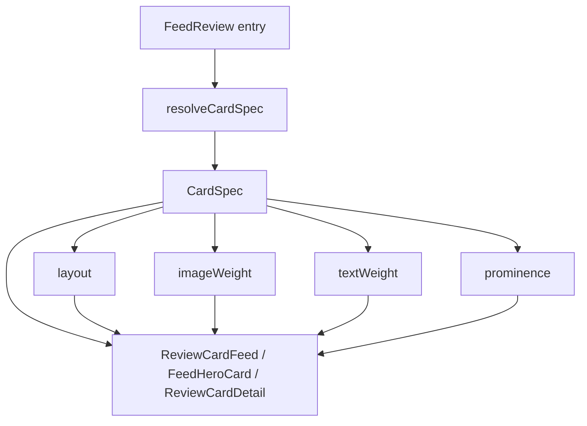

# Plano: Component Specification

> This document gives Cursor two things: exact specifications for listed
> components, and a reasoning foundation for everything else.
>
> When a component or page type is not explicitly listed here, do not
> produce a minimal placeholder. Instead:
> 1. Find the most structurally similar listed component and use its
>    token assembly as the starting point.
> 2. Use Appendix B to select the correct surface, border, and text tokens.
> 3. Use Appendix A for all text styling decisions.
> 4. Apply the Interaction Design Principles in full — they govern
>    every component in this product, listed or not.
>
> A component derived this way will be visually consistent and
> behaviourally intentional. That is the standard.

---

## How to read this document

**Interaction Design Principles** (below, before components) — five
product-specific rules covering progressive disclosure, action
representation, width discipline, action hierarchy, and spacing rhythm.
Read these before building anything. They apply to every component and
every page in this product, whether listed here or not.

**Component entries** (sections 1–12, plus Card System in §14) — for each listed component:
layout composition (structural arrangement), token assembly (visual
properties), interaction design notes (behavioural decisions), and
constraints (Always/Default rules with reasons).

**Appendix A — Typography Matrix** — the authoritative reference for
text size, weight, colour, and spacing across every UI context. When a
component entry does not specify typography, this matrix governs.

**Appendix B — Semantic Colour Guide** — a reasoning guide for choosing
surface, border, text, and feedback tokens in any context. Use it to
derive token choices for components and situations not explicitly covered
in the entries above.

---

## Interaction Design Principles

Plano is an architectural portfolio platform with an **editorial** personality inspired by A24 Films (a24films.com) and contemporary architecture studios (OMA, BIG, Zaha Hadid Architects). Its personality is **editorial, modern, minimalist, sharp, and photographic**. The density setting is **spacious** — generous whitespace creates editorial breathing room. The radius direction is **sharp** — 2px default for app UI, 0px for editorial feed content. In the feed, hierarchy comes from **typography scale and whitespace alone** — not from borders, not from card containers, not from shadows. Tiny metadata lines contrasted against massive bold headlines create structure. Content floats directly on the white canvas. The app shell uses a **horizontal sticky top navigation bar** — not a left sidebar. The body is a two-column grid: fluid center feed + 320px sticky right rail. These five principles are calibrated to that identity, with editorial feed exceptions noted where applicable.

### 1. Progressive Disclosure

**Rule:** Primary actions (Add, Save, View) and safe secondary actions (Filter, Sort) are always visible. Destructive actions (Delete, Archive) and rarely-used secondary actions (Duplicate, Export) in list and table rows are hidden at rest and revealed on hover.

**Implementation:** The row or card container carries `group`. Hidden affordances carry `opacity-0 group-hover:opacity-100 transition-opacity duration-150`. The 150ms duration is fast — Plano's personality is precise and responsive; animations should feel instantaneous, not cushioned.

**Why this applies to Plano:** Architecture portfolios present curated content. A persistent Delete button next to every building card undermines the curatorial composure of the layout. Hiding destructive actions preserves the gallery-like calm and prevents accidental clicks in a photography-dense interface.

**Exception:** A destructive action may be persistently visible when it is the sole action on a dedicated confirmation screen or within a modal whose entire purpose is the destructive operation.

### 2. Action Representation

**Rule:** Use text labels when an action appears once or twice on a screen. Use icon buttons when the action repeats across every row or card in a list or grid. Plano is spacious, not compact — text labels are affordable in single-instance contexts and preferred for clarity.

**Standard icons (lucide-react):**
- Edit: `Pencil` — aria-label: `"Edit {item name}"`
- Delete: `Trash2` — aria-label: `"Delete {item name}"`
- View/Detail: `ArrowUpRight` — aria-label: `"View {item name}"`
- External link: `ExternalLink` — aria-label: `"Open {item name} in new tab"`
- More actions: `MoreHorizontal` — aria-label: `"More actions for {item name}"`
- Close: `X` — aria-label: `"Close"`
- Add: `Plus` — aria-label: `"Add {item type}"`

**Why this applies to Plano:** The spacious layout provides room for text labels in page-level CTAs and modal footers. But building grids, review lists, and collection tables repeat actions per row — icon-only buttons keep each row clean and let the building photography remain the dominant visual element.

### 3. Input and Content Width

**Rule:** Inputs are constrained by expected content length, never stretched to fill available viewport width.

**Width constraints by content type:**
- Building name, project title: `max-w-md` (28rem) — titles are typically under 60 characters
- Short identifiers, building IDs, postcodes: `max-w-xs` (20rem)
- Description, review body, notes: `max-w-xl` (36rem) — multi-line but not full-width
- Numeric values (year, area, floors): `max-w-[8rem]`
- Email, URL: `max-w-sm` (24rem)

**Page-level content width:**
- Data tables and building grids: full content-area width — density is intentional; the table or grid should use all available space within the content region
- Settings pages, single-record forms, profile management: `max-w-2xl` (42rem) — a form stretching to 1440px is a layout decision that was never made
- The underlying principle: an unconstrained input or form on a wide viewport is as much a defect as a wrong colour token

### 4. Action Hierarchy

**Rule:** At most one filled primary button per visible surface. Secondary supporting actions use ghost or outline variants. Row-level actions use icon-only ghost buttons, hover-revealed if destructive.

**Maximum visible actions per surface:** 3 before overflow into a `MoreHorizontal` menu. Plano's spacious layout has room, but architectural composure requires restraint — more than three actions creates toolbar noise.

**Destructive confirmation pattern by severity:**
- Low severity (remove a tag, unlink a collection): inline confirmation — the button text changes to "Confirm?" for 3 seconds, then reverts. No modal.
- Medium severity (delete a review, remove a building from a collection): dialog confirmation with a clear description of what will be lost.
- High severity (delete a building with all associated data, delete account): dialog confirmation requiring the user to type the building name or "DELETE" to proceed.

**Why this applies to Plano:** Buildings and their associated photography, reviews, and metadata represent significant curatorial effort. The confirmation pattern scales with the irreversibility and data loss of each action, ensuring that high-consequence deletions demand deliberate intent.

### 5. Spacing Rhythm

**Rule:** Consistent spacing tokens create visual grouping. Inconsistent gaps between sibling components of the same type are a visual defect — as detectable as a wrong colour, and as worth fixing.

**Token assignments:**
- `spacing-2` (8px): gap between tightly coupled elements within a component — icon and label text, label and input, badge icon and badge text
- `spacing-4` (16px): gap between sibling elements within a component — fields within a form group, items within a card body, action buttons in a row
- `spacing-6` (24px): gap between sibling components on a page — card to card in a grid, section heading to its content block
- `spacing-8` (32px): internal padding of major containers — card padding, modal body padding, page content area padding
- `spacing-12` (48px): separation between logical page sections — the gap between "Building Details" and "Reviews" sections on a building page
- `spacing-16` (64px): major page-level vertical rhythm — top-of-page to first content block, between primary page regions

**Section separation method (app UI — admin, settings, forms):** `spacing-12` margin-top plus a `border-t border-border-default` divider line. Plano's flat design uses borders as the primary section separator — not extra whitespace alone, and never shadows.

**Section separation method (editorial content pages — building detail, profile, architect profile):** `border-t border-border-default` divider with a `text-2xs font-medium uppercase tracking-widest text-text-secondary` section label immediately after it. The section label replaces a traditional `<h2>` heading — it is structural marginalia, not a headline. Vertical padding above the divider: `pt-8` to `pt-12`. This pattern applies to all named sections: "About", "Portfolio", "Reviews", "Location", "Resources", "Highlights", "All-time Favourites", etc.

**Section separation method (editorial feed):** `spacing-16` to `spacing-20` vertical margin between feed items. No borders between major feed items (hero cards, collection cards). The whitespace *is* the separator — editorial breathing room. Borders may appear only as subtle `border-b` dividers between compact/activity card rows where items are dense enough to merge visually.

---

## 1. Page Layout

### Purpose
The outermost structural shell that establishes the page background, top navigation, center feed column, and right rail. Every page in Plano is composed inside this layout.

### Layout Composition
The app root is a flex column: `flex flex-col min-h-screen max-w-[1440px] mx-auto border-x border-border-default`. It contains:

1. **Top header** (sticky) — logo + nav links + search + primary CTA + bell + avatar
2. **App body** — a CSS grid: `grid-template-columns: minmax(0, 1fr) 320px`
   - **Center column** — the main feed/content area with `border-r border-border-default`
   - **Right rail** — 320px sticky secondary column (trending, people, activity)

The **top header** is `sticky top-0 z-50` with a frosted-glass background (`rgba(250,250,250,0.92)` + `backdrop-filter: blur(12px)`). Inner layout: `flex items-center justify-between px-10 py-[18px]`. Left side: logo + nav links. Right side: search field + primary CTA + bell + avatar.

Nav links are `text-sm font-medium text-text-secondary`, active link `text-text-primary` with a `1px` underline injected via `::after` that sits flush with the header's bottom border.

The **center column** has `padding: 0 64px 120px` (horizontal) for the feed. The **page head** within it uses `padding: 48px 64px 36px` with a large bold date/title.

The **right rail** is `position: sticky; top: 73px; height: calc(100vh - 73px); overflow-y: auto; padding: 36px 32px`. It holds stat widgets, trending lists, people-to-follow, and recent activity.

Responsive: below 900px the rail collapses and horizontal padding reduces to 24px.

### Token Assembly

| Part | Property | Token | Tailwind |
|---|---|---|---|
| App root | background | surface-default | bg-surface-default |
| App root | max-width | — | max-w-[1440px] mx-auto |
| App root | side borders | border-default | border-x border-border-default |
| Top header | background | surface-default (92% opacity + blur) | bg-surface-default/95 backdrop-blur-md |
| Top header | border-bottom | border-default | border-b border-border-default |
| Top header | padding-x | — | px-10 |
| Top header | padding-y | — | py-[18px] |
| Nav link (default) | color | text-secondary | text-text-secondary |
| Nav link (active) | color | text-primary | text-text-primary |
| Nav link active underline | — | text-primary | 1px `::after` flush with header bottom |
| Primary CTA ("Log a visit") | background | brand-primary | bg-brand-primary text-text-inverse |
| Bell icon | color | text-secondary → text-primary | hover:text-text-primary |
| Bell notification dot | color | brand-accent | bg-brand-accent |
| Avatar | background | brand-primary | bg-brand-primary text-text-inverse |
| Center column | border-right | border-default | border-r border-border-default |
| Right rail | background | surface-default | bg-surface-default |
| Right rail | padding | — | px-8 pt-9 pb-8 |

### Interaction Design Notes

**Width constraints:** The center column has no inner max-width for the feed. Pages that need a narrower column (settings, forms, single-record views) apply `max-w-2xl mx-auto` inside the center column. Data-heavy pages use the full column width.

**Right rail sticky behaviour:** The right rail scrolls independently of the center column. `top: 73px` matches the header height. It auto-hides the scrollbar (`scrollbar-width: none`).

### Constraints

**Always:** `surface-default` is applied only to the root page background and the right rail — never to cards or panels sitting on it. A component using `surface-default` becomes invisible against the page.

**Always:** The primary CTA and avatar both use `brand-primary` (black) background with `text-inverse` (white) text. Do not use `brand-accent` (lime) for button or avatar backgrounds.

**Always:** The bell notification dot uses `brand-accent` (lime). This is one of the four permitted uses of the lime accent.

**Default:** Center column horizontal padding is `px-16` (64px). Legitimate exception: a full-bleed photo or map view that intentionally bleeds to the column edge.

---

## 2. Card

### Purpose
The primary container surface for grouping related content — a building summary, a review, a stat block, a collection tile. Cards sit on `surface-default` and must be visually distinct from it.

### Layout Composition
Cards are `flex flex-col` containers. Internal content is separated with `gap-4`. When cards appear in a grid, the grid uses `grid grid-cols-1 md:grid-cols-2 lg:grid-cols-3 gap-6`.

For cards containing a hero image (building cards), the image sits at the top with `aspect-[4/3] w-full object-cover rounded-t-sm` and the text content below with `p-6`.

For text-only cards (stat blocks, review cards), the entire card is padded with `p-6`.

### Token Assembly

| Part | Property | Token | Tailwind class |
|---|---|---|---|
| Container | background | surface-card | bg-surface-card |
| Container | border | border-default | border border-border-default |
| Container | border-radius | radius-sm | rounded-sm |
| Container | shadow | shadow-none | shadow-none |
| Container | padding | spacing-6 | p-6 |
| Container | gap (children) | spacing-4 | gap-4 |

### Interactive States

| State | Part | Property | Tailwind class |
|---|---|---|---|
| hover | Container | border | hover:border-border-strong |
| focus-visible | Container | ring | focus-visible:ring-2 focus-visible:ring-brand-accent focus-visible:ring-offset-2 |

### Interaction Design Notes

**Progressive disclosure:** Row-level actions (Edit, Delete) on cards in a grid are hover-revealed. The card container carries `group`. The action container (positioned `absolute top-3 right-3`) carries `opacity-0 group-hover:opacity-100 transition-opacity duration-150`.

**Action representation:** Card actions use icon-only ghost buttons (`Pencil`, `Trash2`, `ArrowUpRight`) because they repeat across every card in the grid. Each button uses `h-8 w-8 p-1.5 rounded-sm` with `bg-surface-card/80 backdrop-blur-sm` to ensure visibility over photographs.

### Constraints

**Always (non-editorial):** Cards in app contexts (admin, settings, tables, building detail pages) use `border border-border-default`. A card with `surface-card` but no border is invisible against `surface-default` in light mode — this is a rendering bug, not a stylistic choice.

**Exception — editorial feed cards:** Feed cards (hero, activity, compact, collection, cluster) do not use the Card component's container styling. They have no `surface-card` background, no `border-default`, no `rounded-sm`. They are open compositions that sit directly on the page surface, with structure provided by typographic hierarchy and vertical spacing. See section 13 (Feed Editorial Components) for their specifications.

**Always:** Cards use `shadow-none` by default. Plano's hierarchy is border-driven, not shadow-driven. Use `shadow-md` only when a card needs explicit visual lift above sibling cards (e.g. a featured or pinned building).

**Default:** Card border-radius is `radius-sm` (2px). The sharp aesthetic is the single most important spatial decision in Plano. Legitimate exception: none — cards are always sharp.

---

## 3. Button

### Purpose
The primary interactive affordance for triggering actions — submitting forms, opening modals, navigating to detail views, confirming destructive operations.

### Layout Composition
Buttons use `inline-flex items-center justify-center gap-2`. Button groups (e.g. modal footer) use `flex items-center gap-3` with the primary action last (rightmost).

### Token Assembly (primary variant — base)

| Part | Property | Token | Tailwind class |
|---|---|---|---|
| Container | background | brand-primary (`#171717`) | bg-brand-primary |
| Container | border-radius | radius-sm | rounded-sm |
| Container | shadow | shadow-none | shadow-none |
| Label | color | brand-primary-foreground (`#FFFFFF`) | text-text-inverse |

### Variants

| Variant | Part | Property | Token | Tailwind class |
|---|---|---|---|---|
| secondary | Container | background | brand-secondary | bg-brand-secondary |
| secondary | Container | border | border-default | border border-border-default |
| ghost | Container | background | transparent | bg-transparent |
| ghost | Container | background (hover) | surface-muted | hover:bg-surface-muted |
| destructive | Container | background | feedback-destructive | bg-feedback-destructive |

### Sizes

| Size | Height | Padding X | Padding Y | Tailwind classes |
|---|---|---|---|---|
| sm | spacing-8 | spacing-3 | spacing-1 | h-8 px-3 py-1 |
| md | spacing-10 | spacing-4 | spacing-2 | h-10 px-4 py-2 |
| lg | spacing-12 | spacing-6 | spacing-3 | h-12 px-6 py-3 |
| icon-sm | spacing-8 | spacing-2 | spacing-2 | h-8 w-8 p-2 |
| icon-md | spacing-10 | spacing-2 | spacing-2 | h-10 w-10 p-2 |

### Interactive States

| State | Part | Property | Tailwind class |
|---|---|---|---|
| hover (primary) | Container | background | hover:bg-brand-primary-hover |
| hover (ghost) | Container | background | hover:bg-surface-muted |
| hover (destructive) | Container | opacity | hover:opacity-90 |
| focus-visible | Container | ring | focus-visible:ring-2 focus-visible:ring-brand-accent focus-visible:ring-offset-2 |
| active (primary) | Container | scale | active:scale-[0.98] |
| disabled | Container | opacity + cursor | disabled:opacity-50 disabled:cursor-not-allowed |

### Interaction Design Notes

**Action representation:** Primary and secondary buttons always use text labels. Ghost icon-only buttons are reserved for repeated row/card actions. A primary button should never be icon-only — the neon accent demands a label to justify its visual weight.

**Action hierarchy:** At most one primary (filled neon) button per visible surface. If two actions compete, the less important one is secondary or ghost. Destructive buttons use the destructive variant — never primary, because the neon accent must not be associated with danger.

### Editorial Text CTA (non-button action pattern)

In editorial contexts (feed, building detail, profile, architect profile), actions are represented as uppercase tracked text links with a `→` arrow — never as filled or outlined buttons. This is the primary CTA pattern for all in-page navigation and action links on content surfaces.

| Part | Property | Tailwind class |
|---|---|---|
| Text (rest) | — | `text-xs font-medium uppercase tracking-widest text-text-primary transition-colors` |
| Text (hover) | — | `hover:text-text-secondary` (dims on hover — does not brighten) |
| Arrow (rest) | — | `→` character, inherits text colour |
| Arrow (hover) | — | shifts to `brand-accent` (lime) — the only lime in the editorial CTA |

Examples: `VIEW BUILDING →`, `WRITE REVIEW →`, `CLAIM PROFILE →`, `ADD FAVOURITES →`, `DIRECTIONS →`, `EDIT →`.

**When to use text CTAs vs. filled buttons:**
- **Text CTA:** any action that appears in-page on a content/feed surface — navigation links, profile actions, section-level management, secondary operations
- **Filled button (primary):** form submissions, modal confirmations, primary actions inside dialogs — contexts where a button's visual weight is semantically appropriate

### Constraints

**Always:** `brand-primary-foreground` (white, `#FFFFFF`) is used for text on `brand-primary` buttons. `brand-primary` is now near-black — it requires white foreground, not dark. Using `text-primary` on a `brand-primary` button is a contrast failure.

**Always:** Focus ring uses `brand-accent` (lime, `#BEFF00`) at 2px offset across all button variants. This is one of the four permitted uses of the lime accent. No exceptions.

**Default:** Button size is `md`. Use `sm` for table row actions and tight toolbar contexts. Use `lg` for page-level hero CTAs. Legitimate exception: a landing page may use a custom larger size, but it must still use `radius-sm`.

---

## 4. Form Field

### Purpose
A single input, textarea, or select element in isolation — the raw interactive control before it is composed with a label and helper text (see Form Structure).

### Layout Composition
Inputs are block-level: `flex w-full`. Textareas add `min-h-[120px] resize-y`. Selects use the same styling as inputs with a trailing `ChevronDown` icon.

### Token Assembly

| Part | Property | Token | Tailwind class |
|---|---|---|---|
| Input | background | surface-muted | bg-surface-muted |
| Input | border | border-default | border border-border-default |
| Input | border-radius | radius-sm | rounded-sm |
| Input | shadow | shadow-none | shadow-none |
| Input | padding-x | spacing-3 | px-3 |
| Input | padding-y | spacing-2 | py-2 |
| Input | height (single-line) | spacing-10 | h-10 |

### Interactive States

| State | Part | Property | Tailwind class |
|---|---|---|---|
| hover | Input | shadow | hover:shadow-sm |
| hover | Input | border | hover:border-border-strong |
| focus-visible | Input | border | focus-visible:border-brand-accent |
| focus-visible | Input | ring | focus-visible:ring-2 focus-visible:ring-brand-accent focus-visible:ring-offset-0 |
| disabled | Input | opacity + cursor | disabled:opacity-50 disabled:cursor-not-allowed |
| error | Input | border | border-feedback-destructive |
| error + focus | Input | ring | focus-visible:ring-2 focus-visible:ring-feedback-destructive focus-visible:ring-offset-0 |

### Interaction Design Notes

**Width constraints:** Inputs must never stretch to full viewport width. Apply `max-w-*` based on expected content (see Principle 3). A building name input uses `max-w-md`; a year input uses `max-w-[8rem]`. The Form Structure component (section 5) is responsible for enforcing this in context — but if a Form Field is ever used standalone, it must still be width-constrained.

**Progressive disclosure:** None — inputs are always fully visible.

### Constraints

**Always:** Inputs use `surface-muted` background, not `surface-card`. This creates a subtle inset that differentiates the editable area from the card surface it sits on. An input with `surface-card` background on a `surface-card` panel is invisible.

**Always:** Error state replaces the border colour with `feedback-destructive` and the focus ring with `feedback-destructive`. The error state must never rely on colour alone — pair it with an error message (see Form Structure).

**Default:** Single-line inputs use `h-10`. Legitimate exception: compact table-inline editing inputs may use `h-8`.

---

## 5. Form Structure

### Purpose
The composition wrapper that assembles a label, a form field, helper text, and an error message into a single form group. This component governs vertical rhythm within forms.

### Layout Composition
Each form group is `flex flex-col gap-1.5`. The label sits above the input. Helper text sits below the input. Error text replaces helper text when validation fails — they never appear simultaneously.

A form itself is `flex flex-col gap-6` — `spacing-6` between field groups. Logical sections within a form (e.g. "Location Details" vs "Building Metadata") are separated by `spacing-12` and a `border-t border-border-default pt-8` divider.

Form-level actions (Submit, Cancel) sit at the bottom in `flex items-center justify-end gap-3 pt-6 border-t border-border-default`.

For constrained-width forms (settings, single-record editing), the entire form wrapper uses `max-w-2xl`.

### Token Assembly

| Part | Property | Token | Tailwind class |
|---|---|---|---|
| Field group | gap (label → input → helper) | spacing-1.5 | gap-1.5 |
| Form | gap (between field groups) | spacing-6 | gap-6 |
| Section divider | border-top | border-default | border-t border-border-default |
| Section divider | padding-top | spacing-8 | pt-8 |
| Section divider | margin-top | spacing-12 | mt-12 |
| Action row | padding-top | spacing-6 | pt-6 |
| Action row | border-top | border-default | border-t border-border-default |
| Action row | gap | spacing-3 | gap-3 |

### Interaction Design Notes

**Width constraints:** The form wrapper itself is constrained (`max-w-2xl` for full-page forms). Individual inputs within the form are further constrained by content type (see Principle 3). A form containing a "Building Name" field and a "Year Built" field should not make both inputs the same width — the name field is `max-w-md`, the year field is `max-w-[8rem]`.

**Edit model:** Forms on dedicated pages (Create Building, Edit Profile) use inline editing — the page is the edit surface. Forms triggered from a list row or card (edit a review, change a building's collection assignment) use modal editing — the data returns to the list on save.

### Constraints

**Always:** Error text replaces helper text — they never coexist. Showing both creates ambiguity about which message applies.

**Always:** The form action row uses `justify-end` — primary action (Save/Submit) is the rightmost button. This is a spatial convention that must not vary across pages.

**Default:** Form section gap is `spacing-12` with a border divider. Legitimate exception: a very short form (2–3 fields, single section) omits section dividers entirely.

---

## 6. Badge

### Purpose
A small inline label communicating status (Published, Draft), category (Residential, Commercial), or count (3 reviews). Badges are read-only — they do not trigger actions.

### Layout Composition
Badges use `inline-flex items-center gap-1`. When badges appear as a set (e.g. building categories), the containing element uses `flex flex-wrap gap-2`.

### Token Assembly (default/neutral variant)

| Part | Property | Token | Tailwind class |
|---|---|---|---|
| Container | background | surface-muted | bg-surface-muted |
| Container | border | border-default | border border-border-default |
| Container | border-radius | radius-sm | rounded-sm |
| Container | padding-x | spacing-2 | px-2 |
| Container | padding-y | spacing-0.5 | py-0.5 |

### Variants

| Variant | Part | Property | Token | Tailwind class |
|---|---|---|---|---|
| brand | Container | background | brand-secondary | bg-brand-secondary |
| brand | Text | colour | brand-secondary-foreground | text-brand-secondary-foreground |
| success | Container | background | feedback-success/10 | bg-feedback-success/10 |
| success | Text | colour | feedback-success | text-feedback-success |
| warning | Container | background | feedback-warning/10 | bg-feedback-warning/10 |
| warning | Text | colour | feedback-warning | text-feedback-warning |
| destructive | Container | background | feedback-destructive/10 | bg-feedback-destructive/10 |
| destructive | Text | colour | feedback-destructive | text-feedback-destructive |

### Constraints

**Always:** Badges use `radius-sm` (2px), not `radius-full`. Pill-shaped badges contradict Plano's sharp aesthetic. Only avatars use `radius-full`.

**Always:** Badge text uses `uppercase tracking-wide` (letter-spacing-wide). This is an intentional architectural convention — small-caps labels echo drafting notation. See the Typography Matrix for exact size and weight.

**Default:** Use the neutral variant unless the badge communicates a specific system status (success, warning, destructive) or brand association. Legitimate exception: none — decorative colour on badges undermines the grayscale discipline.

---

## 7. Table

### Purpose
Presents structured, multi-column data — building lists, review tables, collection inventories. The table is the primary data-browsing surface in Plano.

### Layout Composition
The table sits inside a container: `w-full overflow-x-auto border border-border-default rounded-sm`. The `<table>` element uses `w-full border-collapse`. Header cells use `text-left`. Body rows are full-width. Cells use `px-4 py-3` padding.

For tables with row actions, the last column is right-aligned (`text-right`) and contains the action buttons.

### Token Assembly

| Part | Property | Token | Tailwind class |
|---|---|---|---|
| Container | background | surface-card | bg-surface-card |
| Container | border | border-default | border border-border-default |
| Container | border-radius | radius-sm | rounded-sm |
| Container | shadow | shadow-none | shadow-none |
| Header row | background | surface-muted | bg-surface-muted |
| Header row | border-bottom | border-default | border-b border-border-default |
| Header cell | padding | spacing-4 x, spacing-3 y | px-4 py-3 |
| Body row | border-bottom | border-default | border-b border-border-default |
| Body cell | padding | spacing-4 x, spacing-3 y | px-4 py-3 |

### Interactive States

| State | Part | Property | Tailwind class |
|---|---|---|---|
| hover | Body row | background | hover:bg-brand-secondary |
| selected | Body row | background | bg-brand-secondary |

### Interaction Design Notes

**Progressive disclosure:** Row actions (Edit, Delete, View) are hover-revealed. The `<tr>` carries `group`. The action cell contains buttons wrapped in a container with `opacity-0 group-hover:opacity-100 transition-opacity duration-150`. Exception: if the table has a single primary action per row (e.g. "View Building"), that action may be persistently visible as a text link.

**Action representation:** Row actions use icon-only ghost buttons (`Pencil`, `Trash2`, `ArrowUpRight`), each `h-8 w-8`. They sit in a `flex items-center justify-end gap-1` container within the action cell.

**Edit model:** Clicking a table row (outside the action cell) navigates to the detail view. Inline editing is not used in tables — the data model is too complex. Edit actions open the record in a modal or navigate to an edit page.

**Empty state:** When the table has zero rows, render the Empty State component (section 10) inside the table container, replacing the `<table>` element entirely.

### Constraints

**Always:** Table header text uses `uppercase tracking-wide text-xs font-medium text-text-secondary`. This is the architectural drafting convention — column headers are labelling, not content.

**Always:** Row hover uses `brand-secondary` (`#F5F5F5`, a neutral muted tint), not `surface-default`. This is a subtle but consistent hover signal.

**Default:** Tables use `shadow-none` and rely on the border for containment. Legitimate exception: a table that sits on `surface-muted` (e.g. inside a sidebar panel) may use `shadow-md` to lift it from the muted surface.

---

## 8. Modal / Dialog

### Purpose
A floating overlay that captures focus for a self-contained task — creating a building, editing a review, confirming a destructive action. Modals interrupt the current flow and must be resolved before returning.

### Layout Composition
The backdrop is `fixed inset-0 bg-black/50 z-50 flex items-center justify-center`. The modal container is `flex flex-col w-full max-w-lg mx-4`. Internal structure: header (`flex items-center justify-between p-6 border-b border-border-default`), body (`p-6 overflow-y-auto`), footer (`flex items-center justify-end gap-3 p-6 border-t border-border-default`).

For modals containing forms, the body scrolls independently if content exceeds `max-h-[70vh]`.

### Token Assembly

| Part | Property | Token | Tailwind class |
|---|---|---|---|
| Backdrop | background | — | bg-black/50 |
| Container | background | surface-overlay | bg-surface-overlay |
| Container | border | border-default | border border-border-default |
| Container | border-radius | radius-lg | rounded-lg |
| Container | shadow | shadow-lg | shadow-lg |
| Header | padding | spacing-6 | p-6 |
| Header | border-bottom | border-default | border-b border-border-default |
| Body | padding | spacing-6 | p-6 |
| Footer | padding | spacing-6 | p-6 |
| Footer | border-top | border-default | border-t border-border-default |
| Footer | gap | spacing-3 | gap-3 |

### Interactive States

| State | Part | Property | Tailwind class |
|---|---|---|---|
| — | Close button | — | See Button (ghost, icon-sm) |

### Interaction Design Notes

**Action representation:** The close affordance is an `X` icon button (ghost, icon-sm size) in the top-right of the header. The footer contains text-label buttons: primary action (rightmost, primary variant) and Cancel (ghost variant, leftmost).

**Width constraints:** Default modal width is `max-w-lg` (32rem). For modals containing wide content (a data table, a building comparison view), use `max-w-2xl`. For narrow confirmation dialogs, use `max-w-sm`.

**Edit model:** Modals are used for multi-field editing initiated from list views. Single-value edits (renaming inline) do not warrant a modal.

### Constraints

**Always:** Modals use `shadow-lg` — they float above all page content. Using `shadow-md` or `shadow-none` misrepresents the elevation and makes the backdrop feel disconnected from the modal.

**Always:** Modals use `radius-lg` (6px). This is the one context where a slightly softer radius is permitted — the modal needs to feel like a distinct floating surface, not a sharp cut from the page. This does not extend to the buttons or inputs inside the modal, which remain `radius-sm`.

**Always:** Focus is trapped within the modal. Pressing Escape closes it. These are WCAG requirements, not style choices.

**Default:** Modal width is `max-w-lg`. Legitimate exception: modals displaying tabular data or side-by-side comparisons may use `max-w-2xl`.

---

## 9. Top Navigation

### Purpose
The persistent horizontal navigation bar at the top of every page. Provides access to all primary sections of the application, plus the search command, primary CTA, notifications, and the user avatar.

### Layout Composition
The top nav is a full-width sticky bar: `sticky top-0 z-50`. Its inner wrapper is `flex items-center justify-between px-10 py-[18px] gap-8`.

**Left side:** Plano logo (`h-[22px]`) + horizontal nav links with `gap-1`.

**Right side:** Search field (`w-[320px]`) + primary CTA button + bell icon + avatar.

Each nav link is `text-sm font-medium px-[14px] py-2 rounded-sm`. The active link appends a `::after` pseudo-element: `content: ""; display: block; height: 1px; background: text-primary; margin: 6px -14px -19px` — this underline is flush with the header's bottom border.

### Token Assembly

| Part | Property | Token | Tailwind class |
|---|---|---|---|
| Header bar | background | surface-default/95 + blur | bg-[rgba(250,250,250,0.92)] backdrop-blur-md |
| Header bar | border-bottom | border-default | border-b border-border-default |
| Header bar | z-index | — | z-50 |
| Header bar | padding-x | — | px-10 |
| Header bar | padding-y | — | py-[18px] |
| Nav link (default) | color | text-secondary | text-text-secondary |
| Nav link (hover) | color | text-primary | hover:text-text-primary |
| Nav link (active) | color | text-primary | text-text-primary |
| Nav link active underline | — | text-primary | 1px pseudo-element (see above) |
| Search field | border | border-default | border border-border-default |
| Search field | background | surface-default | bg-surface-default |
| Search field text | color | text-disabled | text-text-disabled |
| Search field (hover) | border | border-strong | hover:border-border-strong |
| Primary CTA ("Log a visit") | background | brand-primary | bg-brand-primary |
| Primary CTA | color | text-inverse | text-text-inverse |
| Primary CTA (hover) | background | brand-primary-hover | hover:bg-brand-primary-hover |
| Bell icon | color | text-secondary | text-text-secondary |
| Bell icon (hover) | color | text-primary | hover:text-text-primary |
| Bell notification dot | color | brand-accent | bg-brand-accent |
| Bell notification dot | border | surface-default | border-[1.5px] border-surface-default |
| Avatar | background | brand-primary | bg-brand-primary |
| Avatar | color | text-inverse | text-text-inverse |
| Avatar | border-radius | radius-full | rounded-full |
| Avatar | size | — | w-8 h-8 |

### Interaction Design Notes

**Action representation:** Nav links use text labels only — no icons in the top nav. The logo is on the far left, separated from nav links by the gap.

**Search field:** Renders as a `<button>` (not an actual `<input>`). Clicking it opens the command palette (⌘K). The `kbd` shortcut hint uses `font-mono text-[10px]`.

**Progressive disclosure:** All top nav items are always visible. No dropdowns or hidden items at desktop width.

### Constraints

**Always:** The bell notification dot uses `brand-accent` (lime) — this is one of the four permitted uses of the lime accent. It must not be any other colour.

**Always:** The primary CTA button (`brand-primary`, black) and avatar use `brand-primary-foreground` (`#FFFFFF`, white) text. No dark text on the black button.

**Always:** Active nav underline is monochromatic (`text-primary` / `#171717`). The top nav is a structural element — `brand-accent` does not appear here.

**Default:** Nav links are `px-[14px] py-2`. The negative bottom margin on the active `::after` pseudo-element (`-19px`) ensures the underline touches the header's bottom border — adjust if header padding changes.

---

## 10. Empty State

### Purpose
Fills a content area when there is no data to display — an empty building list, a collection with no entries, a table with zero results. The empty state provides orientation and an optional CTA to resolve the emptiness.

### Layout Composition
The empty state is centred within its parent container: `flex flex-col items-center justify-center text-center py-16 px-8`. It contains an icon area (48×48, lucide-react icon in `text-text-disabled`), a heading, a description, and an optional primary button.

Internal gap: `gap-4` between all children. The icon sits above the heading with `gap-3` between them.

### Token Assembly

| Part | Property | Token | Tailwind class |
|---|---|---|---|
| Container | padding-y | spacing-16 | py-16 |
| Container | padding-x | spacing-8 | px-8 |
| Container | gap | spacing-4 | gap-4 |
| Icon | size | 48px | h-12 w-12 |
| Icon | colour | text-disabled | text-text-disabled |
| Description | max-width | — | max-w-sm |

### Constraints

**Always:** The description text is constrained to `max-w-sm` so it does not stretch across wide containers. Centred text wider than ~45 characters becomes difficult to read.

**Default:** The CTA button uses the primary variant. Legitimate exception: if the empty state is inside a secondary context (e.g. a sidebar panel), the CTA may use the secondary variant to avoid neon accent overuse.

---

## 11. Loading Skeleton

### Purpose
Animated placeholder blocks that mirror the dimensions of real content, shown while data is being fetched. Skeletons prevent layout shift and communicate that content is loading.

### Layout Composition
Skeletons replicate the layout of the component they replace. A card skeleton matches the card's `flex flex-col gap-4 p-6` structure. A table skeleton uses the same column widths and row heights.

Each skeleton block is a `div` with `animate-pulse rounded-sm`. Heights match the content they replace: heading blocks are `h-6`, body text blocks are `h-4`, image areas are `aspect-[4/3] w-full`.

### Token Assembly

| Part | Property | Token | Tailwind class |
|---|---|---|---|
| Skeleton block | background | surface-muted | bg-surface-muted |
| Skeleton block | border-radius | radius-sm | rounded-sm |
| Skeleton block | animation | — | animate-pulse |

### Constraints

**Always:** Skeleton blocks use `surface-muted`, not `border-default` or a custom grey. The muted surface is the designated "quiet/supporting" token — skeletons are a supporting visual element.

**Always:** Skeleton blocks use `rounded-sm` to match the sharp aesthetic. Do not use `rounded-full` for skeleton lines — that creates a visual inconsistency with the sharp corners of the actual content that replaces them.

**Default:** Use `animate-pulse` (Tailwind's built-in opacity animation). Legitimate exception: none — custom shimmer animations add implementation complexity without design benefit in Plano's minimal system.

---

## 12. Toast / Alert

### Purpose
A transient notification that communicates the result of a system action — a successful save, a validation warning, a destructive error, an informational update. Toasts appear briefly and dismiss automatically or on user action.

### Layout Composition
Toasts are positioned `fixed bottom-6 right-6 z-50` (or in a toast stack container). Each toast is `flex items-start gap-3 w-full max-w-sm p-4`. It contains a status icon (20×20), a text block (title + description in `flex flex-col gap-1`), and an optional dismiss button (`X`, ghost, icon-sm) on the right.

### Token Assembly (info variant — base)

| Part | Property | Token | Tailwind class |
|---|---|---|---|
| Container | background | surface-card | bg-surface-card |
| Container | border | border-default | border border-border-default |
| Container | border-radius | radius-md | rounded-md |
| Container | shadow | shadow-lg | shadow-lg |
| Container | padding | spacing-4 | p-4 |
| Container | gap | spacing-3 | gap-3 |
| Container | max-width | — | max-w-sm |

### Variants

| Variant | Part | Property | Token | Tailwind class |
|---|---|---|---|---|
| success | Left border | border-left | feedback-success | border-l-4 border-feedback-success |
| success | Icon | colour | feedback-success | text-feedback-success |
| warning | Left border | border-left | feedback-warning | border-l-4 border-feedback-warning |
| warning | Icon | colour | feedback-warning | text-feedback-warning |
| destructive | Left border | border-left | feedback-destructive | border-l-4 border-feedback-destructive |
| destructive | Icon | colour | feedback-destructive | text-feedback-destructive |
| info | Left border | border-left | brand-accent | border-l-4 border-brand-accent |
| info | Icon | colour | text-secondary | text-text-secondary |

### Interactive States

| State | Part | Property | Tailwind class |
|---|---|---|---|
| hover (dismiss) | Button | background | hover:bg-surface-muted |
| focus-visible (dismiss) | Button | ring | focus-visible:ring-2 focus-visible:ring-brand-accent focus-visible:ring-offset-2 |

### Interaction Design Notes

**Action representation:** The dismiss button is an `X` icon (ghost, icon-sm). For toasts with an undo action (e.g. after a deletion), add a text button labelled "Undo" between the text block and the dismiss button.

**Progressive disclosure:** All toast content is visible immediately — no hover-reveal. Toasts are transient and must communicate their message within the brief time they are visible.

### Constraints

**Always:** Toasts use `shadow-lg` — they float above all page content, same elevation as modals. Using a lesser shadow makes the toast appear embedded in the page rather than overlaid.

**Always:** Each semantic variant has a 4px left border in the corresponding feedback colour. This coloured accent is the primary differentiator between variants — do not rely on icon alone. The left-border pattern echoes the sidebar's active indicator, creating a consistent "attention here" signal.

**Always:** Toast text uses `text-primary` for the title and `text-secondary` for the description. Do not use feedback colours for toast text — the left border and icon already communicate severity. Coloured text on a white surface at `font-size-sm` can fail contrast checks.

**Default:** Toasts auto-dismiss after 5 seconds. Destructive toasts with an Undo action auto-dismiss after 8 seconds to give the user time to react. Legitimate exception: error toasts that require user acknowledgment (e.g. a failed save with data loss) should persist until manually dismissed.

---

## 13. Feed Editorial Components

### Design Philosophy

The feed follows an editorial magazine aesthetic inspired by A24 Films. The defining characteristics are:

1. **No card containers.** Feed items have no background, border, or shadow. Content sits directly on the white page surface.
2. **Typography is structure.** The contrast between tiny uppercase category labels and massive bold building names creates all the hierarchy needed.
3. **Whitespace is intentional.** Large vertical gaps between feed items create editorial rhythm — each item is a self-contained composition, not a row in a list.
4. **Images are raw.** No border-radius, no borders, no overlays. Sharp edges, like a printed photograph.
5. **CTAs are text, not buttons.** Feed actions use uppercase tracked text with a `→` arrow, never filled buttons.
6. **Monochromatic in the feed.** Black text, gray metadata, white surface. Colour comes only from photography and sparingly from the brand accent on interactive states.

---

### 13a. Feed Hero (editorial opening header)

#### Purpose
The editorial opening of the feed page — a large primary photo with caption alongside a ranked queue of recent activity. It sets the tone before the social feed begins. This is a `<header>` element, not a review card.

#### Layout Composition
The `feed-hero` wrapper bleeds past the feed column's horizontal padding (`margin: 0 -64px; padding: 56px 64px 64px`). It has a `border-bottom: 1px solid var(--text-primary)` (black hairline, not default gray).

Desktop grid: `grid-template-columns: 1.6fr 1fr; gap: 40px; align-items: start`.

**Left — primary photo:** `<figure>` with a full-width image (`aspect-ratio: 16/10; object-fit: cover; filter: contrast(1.02) saturate(0.95)`) and a `<figcaption>` below it:
- Building name: `font-size: 22px; font-weight: 600; letter-spacing: -0.02em; color: text-primary`
- Architect: italic serif style, `color: text-secondary` (uses `font-family: var(--font-serif, Georgia, serif)`)
- Byline: monospace, 10px, `letter-spacing: 0.14em`, uppercase, `text-disabled` — format: `CITY · YEAR · reviewed by NAME`

**Right — queue:** `<ol>` of 4–5 items. Each item: `grid-template-columns: 64px 1fr auto; gap: 16px; padding: 16px 0; border-bottom: 1px solid border-default`. The last item omits the border.
- Thumbnail: 64×64 square, `background-size: cover`, no radius
- Building name: `font-size: 15px; font-weight: 500; letter-spacing: -0.01em; text-primary`
- Sub-meta: monospace, 10px, uppercase, `text-disabled` — reviewer name (text-secondary) + dot + timestamp
- Rating: 3-dot scale (filled vs empty open circle), right-aligned

Mobile: stacks vertically, reduced padding (`32px 24px 40px`).

#### Token Assembly

| Part | Property | Token | Tailwind |
|---|---|---|---|
| Wrapper | background | surface-default | — (transparent) |
| Wrapper | bottom border | text-primary | border-b border-text-primary |
| Wrapper | bleed | — | -mx-16 px-16 |
| Primary image | border-radius | radius-none | rounded-none |
| Primary image | aspect | 16/10 | aspect-[16/10] |
| Caption building name | — | text-primary | text-[22px] font-semibold tracking-[-0.02em] |
| Caption architect | — | text-secondary | italic (font-serif) |
| Caption byline | — | text-disabled | font-mono text-[10px] tracking-[0.14em] uppercase |
| Queue item | bottom border | border-default | border-b border-border-default |
| Queue thumbnail | border-radius | radius-none | rounded-none |
| Queue building name | — | text-primary | text-[15px] font-medium tracking-[-0.01em] |
| Queue sub-meta | — | text-disabled | font-mono text-[10px] uppercase tracking-[0.08em] |
| Queue reviewer name | — | text-secondary | (within sub-meta) |

#### Constraints

**Always:** Hero wrapper uses a black `border-text-primary` bottom border, not `border-border-default`. This is the editorial separator between the hero and the social feed below.

**Always:** Primary image has no radius, no border, no scrim. Raw photography.

**Always:** No category label or review text in the FeedHero — it is a photo + caption + queue, not a review card.

---

### 13a-ii. BuildingAbove

#### Purpose
The metadata line that appears above the `feed-title` in all review card types. Provides city, architect, and year in a single subdued line — contextual without competing with the headline.

#### Layout Composition
`display: flex; align-items: center; gap: 10px; margin-bottom: 10px`.

Content: city, architect, year (any subset). Items are joined by `·` separators (`color: text-disabled`).

#### Token Assembly

| Part | Property | Tailwind |
|---|---|---|
| Container | — | flex items-center gap-[10px] mb-[10px] |
| Text items | — | text-[13px] font-normal tracking-[-0.005em] text-text-secondary |
| Separator `·` | — | text-text-disabled |

---

### 13a-iii. AuthorBelow

#### Purpose
The attribution line that appears below the `feed-title`. Displays reviewer name, timestamp, and award dots.

#### Layout Composition
`display: flex; align-items: center; gap: 10px; flex-wrap: wrap; margin-top: 14px`.

Content: author name (linked, underline on hover) + `·` + timestamp + `·` + award dots (if rating ≥ 1).

#### Token Assembly

| Part | Property | Tailwind |
|---|---|---|
| Container | — | flex items-center gap-[10px] flex-wrap mt-[14px] |
| Author name | — | text-[14px] font-medium text-text-primary border-b border-border-default pb-px cursor-pointer hover:border-text-primary |
| Separator `·` | — | text-text-disabled |
| Timestamp | — | text-[14px] text-text-disabled |
| Award dots | — | see Rating below |

---

### 13a-iv. Feed Title (`feed-title`)

#### Purpose
The building name headline that forms the typographic centrepiece of every review card. Maximum editorial scale.

#### Token Assembly

| Variant | Property | Value |
|---|---|---|
| Default (hero scale) | font-size | `clamp(48px, 6vw, 72px)` |
| `.sm` (split / event) | font-size | `clamp(36px, 4vw, 48px)` |
| All variants | font-weight | 700 |
| All variants | letter-spacing | `-0.035em` |
| All variants | line-height | `0.95` |
| All variants | text-wrap | `balance` |
| All variants | color | `text-primary` |
| Hover | opacity | `0.55` |

#### Constraints

**Always:** `feed-title` must never drop below `clamp(36px, 4vw, 48px)` on desktop. The editorial impact depends on scale.

**Always:** Line-height `0.95` is tighter than any token in the design system — this is deliberate for the display-scale headline. Do not use the `line-height-tight` (1.0) or `line-height-snug` (1.2) Tailwind tokens here; use the raw value.

---

### 13b. FeedReviewHero

#### Purpose
A full-width review card with a wide photo. The primary social feed review format for reviews with photography.

#### Layout Composition
`<article class="feed-item">`. Contains (top to bottom):
1. `BuildingAbove` (city · architect · year)
2. `feed-title` (default scale)
3. `AuthorBelow` (author · timestamp · award dots)
4. Full-width photo: `margin-top: 36px; aspect-ratio: 16/9; object-fit: cover; background: surface-muted`
5. Photo caption (optional): monospace, 10px, `text-disabled`, space between location (`uppercase, tracking-[0.14em]`) and figure number
6. Review body: `font-size: 17px; line-height: 1.75; color: text-primary; max-width: 62ch; margin-top: 32px`
7. "Read the full review →" link (if body exists)
8. `FeedFooter`

**"Read the full review →"** link: `font-size: 11px; font-weight: 500; letter-spacing: 0.18em; uppercase; text-primary`. On hover: dims to `text-secondary`; arrow translates 3px right and shifts to `brand-accent`.

#### Constraints

**Always:** Photo has no radius (`rounded-none`). Image fills the full column width.

---

### 13c. FeedReviewSplit

#### Purpose
A two-column review card — text on the left, portrait photo on the right. Used for reviews with a single strong image where the copy deserves equal billing.

#### Layout Composition
`<article class="feed-item split">`: `display: grid; grid-template-columns: 1fr 1fr; gap: 64px; align-items: start`.

Left column: `BuildingAbove`, `feed-title.sm`, `AuthorBelow`, review body, `FeedFooter`.
Right column: photo `aspect-ratio: 3/4; object-fit: cover; margin-top: 0; rounded-none`.

---

### 13d. FeedReviewText

#### Purpose
A text-only review card — no photo. Used for long-form written reviews without user photography.

#### Layout Composition
Same as `FeedReviewHero` without the photo block. Review body uses the same `17px / 1.75 / 62ch` style.

---

### 13e. FeedReviewShort

#### Purpose
A one-liner review where the body text IS the headline. Used when a review is pithy enough to stand alone as a pull-quote — no photo, no body paragraph.

#### Layout Composition
`<article class="feed-item short">`. Contains:
1. `BuildingAbove` (city · architect · year)
2. `<blockquote class="feed-quote">` — the pull-quote headline
3. `AuthorBelow`
4. `FeedFooter`

The `feed-quote` blockquote renders at display scale: `font-size: clamp(28px, 3vw, 40px); font-weight: 500; letter-spacing: -0.025em; line-height: 1.15; max-width: 24ch; color: text-primary`.

A decorative opening `"` is rendered in serif italic at 1.4× size, `text-disabled`, translated slightly to align optically.

The building name appears **inline inside the blockquote** as a small underlined link immediately after the quote text: `font-size: 0.45em; font-weight: 500; color: text-disabled; border-bottom: 1px solid border-default`. On hover: `text-primary; border-bottom-color: text-primary`.

#### Constraints

**Always:** The building name link is embedded in the quote, not placed on a separate line. The visual read is: massive quote text, then the building name recedes as a small inline reference.

---

### 13f. FeedCluster

#### Purpose
A card showcasing a user's day visiting multiple buildings in one city. The cluster grid is a 3×1 grid of square image cells with gradient overlays.

#### Layout Composition
`<article class="feed-item">`. Contains:
1. `feed-above`: city · "{N} buildings"
2. `feed-title` (default scale): `"A day with {who}."` — the reviewer's name rendered in `text-disabled`
3. `AuthorBelow` (who + when, no rating)
4. Cluster grid: `display: grid; grid-template-columns: repeat(3, 1fr); gap: 1.5px; background: border-default`
5. `FeedFooter`

Each cell: `aspect-ratio: 1/1; overflow: hidden; background: surface-muted`. Cell overlay: `position: absolute; inset: 0; background: linear-gradient(to top, rgba(0,0,0,0.72) 0%, rgba(0,0,0,0) 55%)`. Cell body (bottom-left): building name (`font-size: 15px; font-weight: 600; color: #fff`) + city (`font-size: 10px; uppercase; opacity: 0.7`). Rating dots (top-right): white-filled dots.

#### Constraints

**Always:** Cell images use `rounded-none`. The `1.5px` gap renders as hairline separators between cells — same `mosaic-gap` token used for collection mosaics.

---

### 13g. FeedCollection

#### Purpose
A card showcasing a user-curated collection of buildings as a 4-up portrait mosaic.

#### Layout Composition
`<article class="feed-item">`. Contains:
1. `feed-above`: "Collection · {subtitle} · {N} buildings"
2. `feed-title` (default scale): collection title
3. `AuthorBelow`
4. Collection mosaic: `display: grid; grid-template-columns: repeat(4, 1fr); gap: 1.5px; background: border-default; margin-top: 32px`
5. `FeedFooter`

Each mosaic cell: `aspect-ratio: 4/5; background: surface-muted; overflow: hidden`. Images: `width: 100%; height: 100%; object-fit: cover; rounded-none`.

#### Constraints

**Always:** Mosaic uses `aspect-ratio: 4/5` (portrait), `gap: 1.5px`, and `background: border-default` on the grid container (the gap colour). No radius on cells.

---

### 13h. FeedActivityStream

#### Purpose
A card aggregating recent actions from a user's network — visits, ratings, saves, follows — into a compact list.

#### Layout Composition
`<article class="feed-item">`. Contains:
1. `feed-above`: "Activity · this week"
2. `feed-title.sm` styled at `clamp(28px, 3vw, 36px)`, `font-weight: 500`, `color: text-disabled` — renders as: "From your network."
3. Activity rows list

Each activity row: `display: grid; grid-template-columns: 28px 1fr auto; align-items: center; gap: 14px; padding: 18px 0; border-bottom: 1px solid border-default`.
- Avatar: 28×28, circular, `palette-neutral-800` bg, white initials, `font-size: 10px; font-weight: 600`
- Text: `font-size: 14px; color: text-secondary; letter-spacing: -0.005em`. User name: `text-primary; font-weight: 600`. Verb: `text-disabled`. Building: `text-primary; font-weight: 500`, underlines on hover. Award dots appended inline if rated.
- Timestamp: `font-family: font-mono; font-size: 11px; color: text-disabled; letter-spacing: 0.04em`

No `FeedFooter` — activity stream is not a single likeable item.

#### Constraints

**Always:** The section title ("From your network.") uses `text-disabled` (not `text-secondary`) at medium weight — it reads as structural metadata, not content.

---

### 13i. FeedEvent

#### Purpose
A card promoting an upcoming architectural event (walk, talk, visit) to the user's network.

#### Layout Composition
`<article class="feed-item">`. Contains:
1. `feed-above`: "Event · {location}"
2. `feed-title.sm`: event title
3. `AuthorBelow`: organiser + attendee count + date
4. Event card: `display: grid; grid-template-columns: 88px 1fr auto; gap: 24px; align-items: center; padding: 20px 24px; border: 1px solid border-default; background: surface-card; margin-top: 24px`
5. No `FeedFooter`

Date block: 88px square, `border: 1px solid border-default`, `font-family: font-mono`, centred. Month: `font-size: 10px; uppercase; letter-spacing: 0.12em; text-secondary`. Day: `font-size: 28px; font-weight: 700; letter-spacing: -0.02em; text-primary`.

Body: title (`font-size: 18px; font-weight: 600; text-primary`) + subtitle line (`font-size: 12px; text-secondary`).

RSVP button: `font-size: 10px; font-weight: 500; letter-spacing: 0.18em; uppercase; padding: 8px 14px; border: 1px solid text-primary; background: transparent; color: text-primary`. Hover: inverts to `background: text-primary; color: #fff`.

#### Constraints

**Always:** The event card container (`event-card`) uses `surface-card` + `border-default` — it is the one place a box appears in the feed, justified because an event has a concrete date and needs visual containment.

---

### 13j. Feed Footer (`FeedFooter`)

#### Purpose
The action row at the bottom of all review cards (Hero, Split, Text, Short, Cluster, Collection).

#### Layout Composition
`display: flex; justify-content: space-between; align-items: center; margin-top: 32px`.

**Left:** Like button + Discuss button, separated by `border-right: 1px solid border-default`.
**Right:** Save button.

Each button: `font-size: 10px; font-weight: 500; letter-spacing: 0.18em; uppercase; color: text-secondary; padding: 10px 18px; display: inline-flex; align-items: center; gap: 8px`. First button has `padding-left: 0`.

Like/Discuss icons: `width: 12px; height: 12px; stroke: currentColor; fill: none; stroke-width: 1.6`.

Count: monospace, `font-size: 10px`, zero-padded to 3 digits (e.g. `017`).

**States:**
- Liked: `color: text-primary`; heart icon `fill: text-primary`
- Saved: bookmark icon `fill: text-primary`

#### Constraints

**Always:** "Open" / view-building button is removed from the footer. The only actions are Like, Discuss, and Save.

**Always:** All footer text uses `uppercase tracking-widest`. Icons are 12×12.

---

### 13k. Feed Section Divider

#### Purpose
A typographic separator between named feed sections (e.g. "Collections · This week", "From the community"). Heavier than the default hairline — it marks a significant editorial break.

#### Layout Composition
`display: flex; justify-content: space-between; align-items: baseline; padding: 64px 0 40px; border-bottom: 1px solid var(--text-primary)`.

**Left:** `<span class="lbl">` — monospace § prefix + section label.
**Right:** CTA link ("See all →", "Explore →", etc.)

#### Token Assembly

| Part | Property | Tailwind |
|---|---|---|
| Bottom border | text-primary (black) | border-b border-text-primary |
| Padding | — | py-16 pb-10 |
| § prefix | — | font-mono text-[10px] text-text-disabled tracking-[0.04em] mr-3 |
| Label text | — | text-[11px] font-medium tracking-[0.2em] uppercase text-text-primary |
| CTA text | — | text-[10px] font-medium tracking-[0.18em] uppercase text-text-primary |
| CTA arrow | — | `→` — shifts to `brand-accent` on hover |

#### Constraints

**Always:** Section divider bottom border uses `text-primary` (black), not `border-default` (gray). This is the editorial signal for a major section break.

**Always:** The § prefix is monospace and `text-disabled`. It is numeric marginalia — not a heading level.

---

---

### 13l. Rating / Award Dots

#### Purpose
A compact visual indicator of a reviewer's assessment of a building — rendered as filled dots on a `surface-muted` pill. Represents award tier, not a star rating.

#### Layout
`display: inline-flex; gap: 4px; align-items: center; padding: 3px 8px; background: surface-muted; border-radius: 2px`.

Each dot: `width: 7px; height: 7px; border-radius: 9999px; background: text-primary` (filled).

#### Scale
| n | Label |
|---|---|
| 1 | Impressive |
| 2 | Essential |
| 3 | Masterpiece |

**Only render if `n ≥ 1`.** Never show empty dots inline in `AuthorBelow` or `FeedFooter`. In the `FeedHero` queue, a 3-dot scale is shown with unfilled circles for unearned dots (empty: `background: transparent; border: 1px solid border-default; width: 5px; height: 5px`).

#### Constraints

**Always:** Rating dots use `text-primary` fill (monochromatic). `brand-accent` (lime) must not be used for rating dot fill.

**Always:** Dots are circular (`border-radius: 9999px`), not square.

---

## 14. Card System — Spec-Driven Review Cards

This section documents how **review cards** are chosen and laid out in the product. The feed aggregation layer (`aggregateFeed`) still decides **which feed row type** runs (`hero`, `compact`, `activity`, etc.). **`CardSpec`** (from `resolveCardSpec`) decides **how the review chrome behaves** inside **`ReviewCardFeed`** (used for both **`hero`** and **`compact`** rows on the main social feed) and **`FeedHeroCard`** (e.g. the community discovery list in **`ColdStartFeed`**). Detail surfaces use **`ReviewCardDetail`**.

### 14.1. Types and resolver

**`CardSpec`** (see `src/types/cards.ts`) has four fields, all outputs of `resolveCardSpec(entry)`:

| Field | Values | Meaning |
| --- | --- | --- |
| `layout` | `media-forward`, `balanced`, `text-forward`, `compact-stack` | Media vs copy arrangement inside the card. |
| `imageWeight` | `none`, `single`, `pair`, `gallery` | Tier from **usable** user review image URLs (0 / 1 / 2 / 3+). |
| `textWeight` | `none`, `snippet`, `body`, `essay` | Tier from **word count** of `entry.content` (0 words / under 20 / under 150 / 150+). |
| `prominence` | `standard`, `elevated` | Emphasis tier from engagement and author signals. |

**`resolveCardSpec`** (`src/features/feed/utils/resolveCardSpec.ts`) is pure: it does not import React or Supabase. **`layout`** comes from a fixed matrix keyed by `imageWeight` + `textWeight`. **`prominence`** is `elevated` when any of: `likes_count > 50`, `user.followers_count > 500`, `user.is_verified_architect`, `user.is_architect_of_building`.

Feed aggregation attaches `spec: resolveCardSpec(entry)` on items that carry a review; the feed page passes `item.spec` into **`ReviewCardFeed`** for **`hero`** and **`compact`** items. Pass **`spec`** into **`FeedHeroCard`** wherever that component is wired for layout (e.g. cold-start discovery).

### 14.2. Decision flow



ASCII equivalent (read top to bottom):

```
FeedReview
  |-- content ----> word count ----> textWeight
  |-- images[] (valid URLs) ----> imageWeight
  +-- likes, followers, author flags ----> prominence

resolveCardSpec ----> layout = matrix[imageWeight + textWeight]

CardSpec { layout, imageWeight, textWeight, prominence }
  |
  v
Aspect ratios, carousel vs grid, side-by-side vs stack, line-clamps, elevated chrome
```

### 14.3. Product archetypes (five named patterns)

These names are how designers and engineers talk about cards; they map to **`CardSpec` combinations** and **which component renders them**, not to separate React components.

| Archetype | Typical triggers (conceptual) | Layout / media behaviour | Component(s) | Representative `CardSpec` notes |
| --- | --- | --- | --- | --- |
| **hero-gallery** | Feed row type **`hero`** (user images present); **`imageWeight`** `pair` or `gallery` | Carousel when gallery + enough stills; two-up grid for `pair`; strong photo lead; alternating image side on main feed | **`ReviewCardFeed`** (main feed **`hero`** slot); **`FeedHeroCard`** (e.g. **`ColdStartFeed`** discovery) | `imageWeight`: `pair` / `gallery`; `layout` often `media-forward` or `balanced` |
| **hero-text** | **`hero`** row with long or medium copy | Copy-led: **`text-forward`** layout; image supports text; clamps from `textWeight` | **`ReviewCardFeed`** / **`FeedHeroCard`** (same split as above) | `textWeight`: `body` / `essay`; `layout`: `text-forward` when matrix yields it (e.g. essay + single image) |
| **standard** | Default prominence; no special author/engagement tier | Baseline chrome: building title `font-semibold`; standard aspect tokens | **`ReviewCardFeed`**, **`FeedHeroCard`**, **`ReviewCardDetail`** | `prominence`: `standard` |
| **minimal** | Little or no body + low image tier | **`compact-stack`** layout; compact aspect; no side-by-side media on md+ (default variant) | **`ReviewCardFeed`** (default variant) | `layout`: `compact-stack`; often `textWeight` `none`/`snippet` and/or `imageWeight` `none` |
| **elevated** | High likes, high followers, verified architect, or architect of building | Subtle emphasis (e.g. bolder building name in feed header); same structural layout as otherwise | **`ReviewCardFeed`** (and other spec-aware surfaces) | `prominence`: `elevated` (orthogonal to `layout`) |

**Feed row type vs `CardSpec`:** `aggregateFeed` promotes reviews with **user-attached images** to a **`hero`** item. On **`Index`**, **`hero`** renders as **`ReviewCardFeed`** (default variant, alternating `imagePosition`). Reviews without user images are clustered and emitted as **`compact`** — **`ReviewCardFeed`** with `variant="compact"`. **`activity`** rows use **`FeedActivityCard`**; they may carry a `spec` for consistency, but the activity layout is not driven by `CardSpec` the same way. **`ReviewCardDetail`** uses **`useReviewCardData`** and the detail layout.

### 14.4. Implementation hooks (for new archetypes)

To add or change a card presentation:

1. **Adjust the contract** in `src/types/cards.ts` only if you need new enum values.
2. **Change scoring** in `resolveCardSpec.ts` (matrix, word bands, image counting, prominence rules) and extend **`resolveCardSpec.test.ts`**.
3. **Update UI** in **`ReviewCardFeed`** (primary feed), **`FeedHeroCard`** (where still used, e.g. cold-start), and/or **`ReviewCardDetail`** to branch on the new `CardSpec` fields.
4. **Add or edit fixtures** in `src/features/superadmin/fixtures/cardFixtures.ts` and validate in the playground.

### 14.5. Superadmin card playground

Route **`/superadmin/cards`** (`CardPlayground.tsx`) renders fixtures with **`ReviewCardFeed`** and **`ReviewCardDetail`**, shows the computed **`CardSpec`**, and provides sliders/toggles to mutate a local copy of the entry. Use it to iterate on layout and elevated treatment without touching production feed data. Access is restricted (superadmin profile or configured allowlist — see app routing/guard).

---

## 15. Content Detail Pages (Building / Profile / Architect)

### Design Philosophy

Content detail pages — building detail, user profile, architect profile — follow the same editorial principles as the feed. They are a continuation of the magazine aesthetic into deep-dive territory. The page is a single-column canvas, not a dashboard.

### Layout

**Max-width:** `max-w-4xl mx-auto` — all content detail pages are single-column and centred at this width. No right sidebar. The sidebar layout (two-column with a 320px right panel) is prohibited on content pages.

**Hero image:** Flush to the layout edge, no border-radius, no scrim/gradient overlay. Image height: `h-[clamp(200px,40vh,520px)]` (building), shorter for profile headers. Fallback: `bg-surface-muted`.

**Page title:** Appears below the image (not overlaid on it). Size: `text-4xl md:text-5xl lg:text-6xl font-bold tracking-tight`. No subtitle card or header box.

### Section Pattern

Every named section on a content detail page follows this exact structure:

```
<div class="border-t border-border-default pt-8 mt-12">
  <span class="text-2xs font-medium tracking-widest uppercase text-text-secondary">Section Name</span>
  <!-- section content -->
</div>
```

The uppercase tracked label *is* the section heading. No `<h2>` or `<h3>` tags at large size. The label is marginalia — structural, not dominant.

### Tab Strip (Profile / Architect pages)

| Part | Property | Tailwind class |
|---|---|---|
| Tab list | border-bottom | `border-b border-border-default` |
| Tab item | typography | `text-xs font-medium uppercase tracking-widest` |
| Tab item (active) | indicator | `border-b-2 border-text-primary text-text-primary` |
| Tab item (inactive) | colour | `text-text-disabled` |
| Tab item gap | — | `gap-6` or `gap-8` |

No `brand-primary` in tab indicators. Active state is monochromatic `border-text-primary`.

### Portfolio Grid (Architect)

The architect portfolio grid uses a flush tile layout:

| Part | Property | Tailwind class |
|---|---|---|
| Grid | structure | `grid grid-cols-1 md:grid-cols-2 lg:grid-cols-3 gap-px bg-border-default` |
| Tile | background | `bg-surface-default` |
| Tile image | border-radius | `rounded-none` |
| Tile image | aspect | `aspect-[4/3]` |
| Tile caption | padding | `px-1 py-3` |
| Tile title | — | `text-sm font-semibold text-text-primary` |
| Tile meta | — | `text-2xs text-text-secondary` |
| Save action | — | text CTA pattern: `text-xs font-medium uppercase tracking-widest` |

The `gap-px bg-border-default` pattern produces 1px hairline dividers between tiles — the grid reads as a single photographic array, not as individual cards.

### Profile Highlights & Favourites

| Pattern | Tailwind class |
|---|---|
| Section header | `border-t border-border-default pt-4` + uppercase tracked label |
| Edit/Manage CTA | text CTA: `text-xs font-medium uppercase tracking-widest text-text-secondary hover:text-text-primary` |
| Style tags | Plain text, no pill borders: `px-3 py-1 text-sm font-medium text-text-secondary` |
| Quote blockquote | `border-l-[3px] border-text-primary pl-4 py-2` (monochromatic) |
| Architect avatar (people section) | Square `h-20 w-20 rounded-none` — not circular |
| Favourite poster | `aspect-square rounded-none` sharp image, text below |

### Constraints

**Always:** Content detail pages use a single-column `max-w-4xl` layout. No right sidebar.

**Always:** Page titles appear below the hero image, never overlaid on it. No gradient scrim on the hero.

**Always:** Section labels use the `text-2xs uppercase tracking-widest text-text-secondary` pattern — not `<h2>` or `<h3>` at heading scale.

**Always:** All interactive text links on content detail pages use the text CTA pattern (`uppercase tracking-widest text-xs font-medium`). No filled buttons in content page body sections.

**Always:** `brand-accent` (lime) does not appear on content detail pages outside of focus rings. Primary buttons inside modals use `brand-primary` (black). The rest of the page is strictly monochromatic.

---

## Appendix A — Typography Application Matrix

When a component entry does not specify typography for an element, this
matrix takes precedence. Override it in a specific entry only with a
documented reason.

| Context | Size | Weight | Colour | Letter-spacing | Line-height |
|---|---|---|---|---|---|
| Page title (h1) | font-size-4xl | font-weight-bold | text-primary | letter-spacing-tight | line-height-tight |
| Section heading (h2) | font-size-3xl | font-weight-semibold | text-primary | letter-spacing-tight | line-height-tight |
| Card title (h3) | font-size-xl | font-weight-semibold | text-primary | letter-spacing-normal | line-height-tight |
| Subsection heading (h4) | font-size-base | font-weight-semibold | text-primary | letter-spacing-normal | line-height-tight |
| Body copy | font-size-base | font-weight-normal | text-primary | letter-spacing-normal | line-height-normal |
| Supporting / secondary text | font-size-sm | font-weight-normal | text-secondary | letter-spacing-normal | line-height-normal |
| Table header | font-size-xs | font-weight-medium | text-secondary | letter-spacing-wide | line-height-normal |
| Table cell | font-size-sm | font-weight-normal | text-primary | letter-spacing-normal | line-height-normal |
| Form label | font-size-sm | font-weight-medium | text-primary | letter-spacing-normal | line-height-normal |
| Input placeholder | font-size-sm | font-weight-normal | text-disabled | letter-spacing-normal | line-height-normal |
| Helper / hint text | font-size-xs | font-weight-normal | text-secondary | letter-spacing-normal | line-height-normal |
| Error text | font-size-xs | font-weight-normal | feedback-destructive | letter-spacing-normal | line-height-normal |
| Button label | font-size-sm | font-weight-medium | [variant-foreground] | letter-spacing-normal | line-height-tight |
| Badge / tag | font-size-xs | font-weight-medium | [variant-foreground] | letter-spacing-wide | line-height-tight |
| Nav item (default) | font-size-sm | font-weight-medium | text-primary | letter-spacing-normal | line-height-normal |
| Nav item (active) | font-size-sm | font-weight-semibold | text-primary | letter-spacing-normal | line-height-normal |
| Caption / timestamp | font-size-xs | font-weight-normal | text-secondary | letter-spacing-normal | line-height-normal |
| Code / monospace | font-size-sm (font-mono) | font-weight-normal | text-primary | letter-spacing-normal | line-height-normal |
| Building ID / short_id | font-size-xs (font-mono) | font-weight-normal | text-secondary | letter-spacing-wide | line-height-normal |
| Empty state heading | font-size-lg | font-weight-semibold | text-primary | letter-spacing-normal | line-height-tight |
| Empty state description | font-size-sm | font-weight-normal | text-secondary | letter-spacing-normal | line-height-normal |
| Modal title | font-size-lg | font-weight-semibold | text-primary | letter-spacing-normal | line-height-tight |
| Toast title | font-size-sm | font-weight-semibold | text-primary | letter-spacing-normal | line-height-tight |
| Toast description | font-size-sm | font-weight-normal | text-secondary | letter-spacing-normal | line-height-normal |
| Map pin label | font-size-xs | font-weight-medium | text-primary | letter-spacing-normal | line-height-tight |
| | | | | | |
| **Feed editorial** | | | | | |
| Feed title (hero scale) | clamp(48px, 6vw, 72px) | font-weight-bold | text-primary | -0.035em | 0.95 |
| Feed title (.sm scale) | clamp(36px, 4vw, 48px) | font-weight-bold | text-primary | -0.035em | 1.0 |
| Feed above-title line | 13px | font-weight-normal | text-secondary | -0.005em | line-height-normal |
| Feed pull-quote (short review) | clamp(28px, 3vw, 40px) | font-weight-medium | text-primary | -0.025em | 1.15 |
| Feed review body | 17px | font-weight-normal | text-primary | letter-spacing-normal | 1.75 |
| Feed author name | font-size-sm | font-weight-medium | text-primary | -0.005em | line-height-normal |
| Feed timestamp | font-size-sm | font-weight-normal | text-disabled | -0.005em | line-height-normal |
| Feed CTA link | font-size-xs | font-weight-medium | text-primary (arrow → brand-accent on hover) | letter-spacing-widest | line-height-tight |
| Feed section divider label | 11px | font-weight-medium | text-primary | 0.2em | line-height-normal |
| Feed section divider § prefix | font-size-xs (mono) | font-weight-normal | text-disabled | 0.04em | line-height-normal |
| Feed photo caption | font-size-xs (mono) | font-weight-normal | text-disabled | 0.04em | line-height-normal |
| Feed footer action | 10px | font-weight-medium | text-secondary | 0.18em | line-height-normal |
| Feed activity row timestamp | 11px (mono) | font-weight-normal | text-disabled | 0.04em | line-height-normal |
| Right rail section label | 11px | font-weight-medium | text-disabled | 0.18em | line-height-normal |
| Right rail stat value | 24px | font-weight-semibold | text-primary | -0.025em | 1.0 |
| Right rail stat label | 10px | font-weight-medium | text-disabled | 0.14em | line-height-normal |
| Right rail trending rank | font-size-xs (mono) | font-weight-normal | text-disabled | 0.04em | line-height-normal |
| Top nav link (default) | 14px | font-weight-medium | text-secondary | -0.01em | line-height-normal |
| Top nav link (active) | 14px | font-weight-medium | text-primary | -0.01em | line-height-normal |
| | | | | | |
| **Content detail pages** | | | | | |
| Page hero title | font-size-4xl / 5xl / 6xl | font-weight-bold | text-primary | letter-spacing-tight | line-height-tight |
| Page section label | font-size-2xs | font-weight-medium | text-secondary | letter-spacing-wide | line-height-normal |
| Tier / rank label | font-size-2xs | font-weight-medium | text-secondary | letter-spacing-wide | line-height-normal |
| Inline CTA (text link + arrow) | font-size-xs | font-weight-medium | text-primary | letter-spacing-wide | line-height-tight |
| Tab item (active) | font-size-xs | font-weight-medium | text-primary | letter-spacing-wide | line-height-normal |
| Tab item (inactive) | font-size-xs | font-weight-medium | text-disabled | letter-spacing-wide | line-height-normal |
| Profile stat value | font-size-2xl | font-weight-bold | text-primary | letter-spacing-tight | line-height-tight |
| Profile stat label | font-size-2xs | font-weight-medium | text-secondary | letter-spacing-wide | line-height-normal |
| Portfolio tile title | font-size-sm | font-weight-semibold | text-primary | letter-spacing-normal | line-height-tight |
| Portfolio tile meta | font-size-2xs | font-weight-normal | text-secondary | letter-spacing-normal | line-height-normal |
| Highlights sub-label | font-size-2xs | font-weight-medium | text-disabled | letter-spacing-wide | line-height-normal |
| Quote blockquote | font-size-sm | font-weight-medium | text-secondary | letter-spacing-normal | line-height-relaxed |

---

## Appendix B — Semantic Colour Usage Guide

A reasoning guide, not a prohibition list. When choosing tokens for a
component not explicitly covered above, match the component's role to
the descriptions below. The surface hierarchy creates depth; the text
hierarchy creates emphasis. A token that misrepresents either hierarchy
— even subtly — makes the UI feel flat or incoherent, even when
individual components look correct in isolation.

**Surface tokens**

`surface-default` is the page canvas, applied once to the root layout.
A component that shares this token with the page background becomes
invisible against it.

`surface-card` is for any contained block that groups content and sits
on the page background: building cards, data panels, stat blocks,
review cards, collection tiles, table containers, and modal bodies.
In non-editorial contexts, `surface-card` is always paired with
`border-default` — shadow is optional and discouraged (prefer
border-only cards; use `shadow-md` only when explicit lift is needed).
A card with `surface-card` and no border is invisible in light mode.

**Editorial feed exception:** Feed components (section 13) do not use
`surface-card` or `border-default`. Content sits directly on the page
surface with no container. Structure comes from typographic scale
contrast, generous vertical spacing, and content grouping.

`surface-muted` signals reduced visual prominence. Use it for areas
that support the primary content: the sidebar background, input field
backgrounds, table header rows, badge backgrounds, skeleton shimmer
areas, code blocks, and filter panels. If a nested element should read
as quieter than its parent card, `surface-muted` is the right choice.
Never use it on action-bearing components (buttons, primary CTAs).

`surface-overlay` is for modals and popovers — elements that float
above all page content. It must always be accompanied by a `bg-black/50`
backdrop and `shadow-lg`.

**Border tokens**

`border-default` provides structure without drawing the eye. It is the
standard border for all components at rest: cards, inputs, table cells,
dividers, section separators. In Plano's minimal system, borders are
the primary hierarchy mechanism — they replace shadows in most contexts.
When uncertain, start here.

`border-strong` communicates that something is active, focused, or
selected. Use it for: a focused input, a selected sidebar item, a
highlighted table row. These three contexts and no others. Do not use
for decorative emphasis.

**Text tokens**

`text-primary` is for content the user must read to complete a task:
headings, body copy, form labels, table cell values, modal headings,
nav items. Near-black, maximum contrast. Default to this when uncertain.

`text-secondary` provides context but is not the primary action target:
timestamps, helper text, column headers, metadata, empty-state
descriptions. Never for interactive labels or required form labels.

`text-disabled` is exclusively for placeholder text and disabled element
labels. Not for de-emphasised content — use `text-secondary` for that.

`text-inverse` is for text on dark or brand-coloured surfaces. Never
place `text-primary` on a dark background.

**Brand accent usage**

`brand-primary` (`#171717`) is the primary action colour — **near-black**. Use it for: primary button backgrounds, avatar backgrounds, and the primary CTA in the top nav. `brand-primary-foreground` is `#FFFFFF` (white) — always white text on a black button. This is the most-used action token.

`brand-accent` (`#BEFF00`) is the lime accent. It appears in exactly four places across the entire product: the notification dot on the bell icon, the `→` arrow of a CTA text link on hover, focus rings (`ring-brand-accent`), and the active chip inside overlaid dark panels (tweaks, dark menus). If `brand-accent` appears outside these four contexts it is an error. It must not be used for: button backgrounds, section accent bars, rating dots, bookmark fills, tab indicators, avatar borders, or any fill state on content or feed pages.

`brand-accent-foreground` (`#171717`) is always dark. The lime is a light colour — it requires dark foreground.

`brand-secondary` (`#F5F5F5`) is a neutral muted surface — not a neon tint. Use for secondary button backgrounds and subdued highlights in app UI contexts.

**Feedback tokens**

`feedback-success` (true green), `feedback-warning` (amber), and
`feedback-destructive` (red) are for system-generated status only:
toasts, validation, badges, alerts. Not for decorative colour. Each
has a `*-foreground` token — always pair them. `feedback-success` is
intentionally differentiated from `brand-primary` by hue so that
"success" and "brand" are never conflated.
